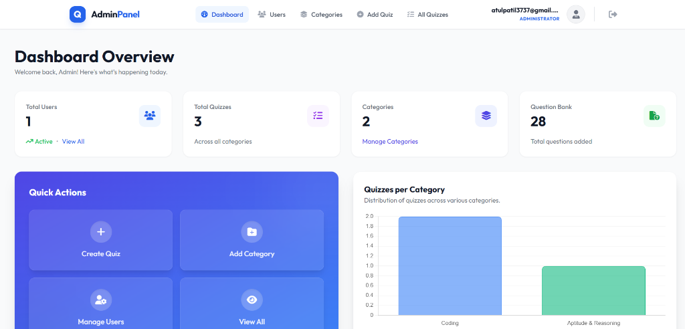
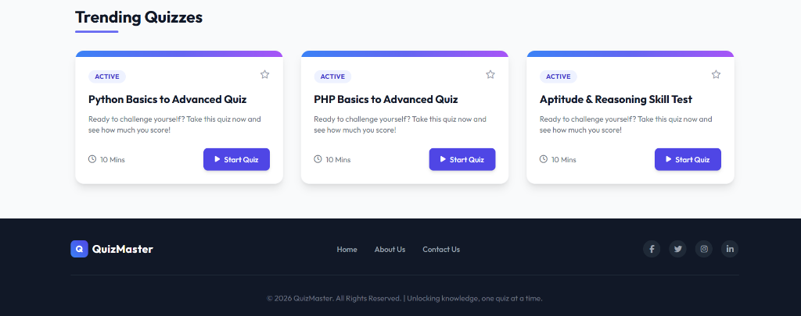
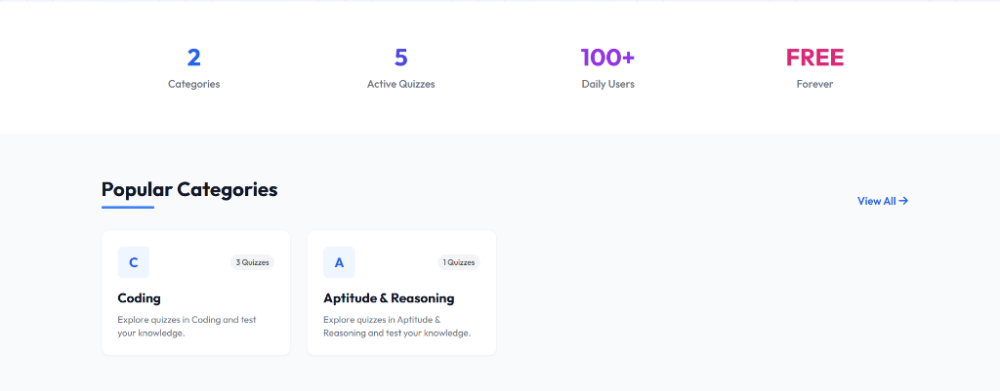

# Quiz Master - Advanced Quiz Management System

## 🚀 About the Project
**Quiz Master** is specific and robust web-based quiz application designed to facilitate seamless online testing and skill assessment. It features a powerful **Admin Panel** for comprehensive management of quizzes and users, and an intuitive **User Interface** for an engaging learning experience.


## ✨ Key Features

### 👨‍💻 Admin Panel
*   **Dynamic Dashboard**: Get an overview of total users, active quizzes, and question bank statistics.
*   **Quiz Management**: Create, update, and delete quizzes effortlessly.
*   **Question Bank**: Add unlimited Multiple Choice Questions (MCQs) to your quizzes.
*   **Category Management**: Organize quizzes into different categories (e.g., Coding, Aptitude).
*   **User Management**: View registered users, manage their status (Active/Block), or remove them.
*   **secure Authentication**: Secure login system for administrators.

### 🎓 User Panel
*   **User Dashboard**: Track your progress, view trending quizzes, and explore categories.
*   **Live Quiz Interface**: Take quizzes in a real-time, responsive environment.
*   **Instant Results**: Get immediate feedback with scores and correct answer explanations.
*   **Detailed Analysis**: Review your performance question-by-question (Correct vs. Incorrect).
*   **Certificate Generation**: Earn and download certificates upon passing quizzes.
*   **History**: Access your past attempts and scores.

## 📸 Screenshots

### Admin Dashboard
*Comprehensive overview of system statistics and quick actions.*


### User Home & Trending Quizzes
*Engaging landing page with top-rated quizzes.*


### Quiz Categories
*Explore quizzes by topics.*


---

## 🛠️ Installation Guide

Follow these steps to set up the project locally on your machine.

### Prerequisites
*   PHP >= 8.1
*   Composer
*   Node.js & NPM
*   MySQL Database

### Step-by-Step Setup

1.  **Clone the Repository**
    ```bash
    git clone https://github.com/yourusername/quiz_system.git
    cd quiz_system
    ```

2.  **Install PHP Dependencies**
    ```bash
    composer install
    ```

3.  **Install Frontend Dependencies**
    ```bash
    npm install
    npm run build
    ```

4.  **Environment Configuration**
    *   Rename the example environment file:
        ```bash
        cp .env.example .env
        ```
    *   Open `.env` file and configure your database details:
        ```env
        DB_CONNECTION=mysql
        DB_HOST=127.0.0.1
        DB_PORT=3306
        DB_DATABASE=quiz_system_db
        DB_USERNAME=root
        DB_PASSWORD=
        ```

5.  **Generate Application Key**
    ```bash
    php artisan key:generate
    ```

6.  **Run Database Migrations**
    Create the tables in your database:
    ```bash
    php artisan migrate
    ```

7.  **Start the Server**
    ```bash
    php artisan serve
    ```

    Visit `http://127.0.0.1:8000` in your browser.

---

## 👤 Credentials (Default)

**Admin Login:**
*   **Email:** `admin@gmail.com`
*   **Password:** `12345678` (or as configured)

---

## 🤝 Contributing
Contributions are welcome! Please feel free to submit a Pull Request.

## 📄 License
This project is open-sourced software licensed under the [MIT license](https://opensource.org/licenses/MIT).
